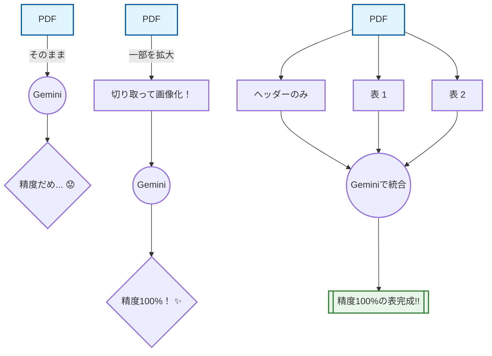

  

| 機器番号 | 名 称   | 系 統 | 仕    様 | 動 力（50Hz） | 付属品・その他 | 台数 | 設置場所 | 備 考 |
|----------|--------|-------|---------|---------------|----------------|------|----------|------|
| 型 式    | 番手   | 機器風量 | 静圧 | 騒音値 | 相 | 消費電力 | 操作 | 監視 | 種別 | 階 | 部 屋 名 | ＃(φ) | m3/h | Pa | (dB) | P-V（KW） | （参考型番） |   |   |
