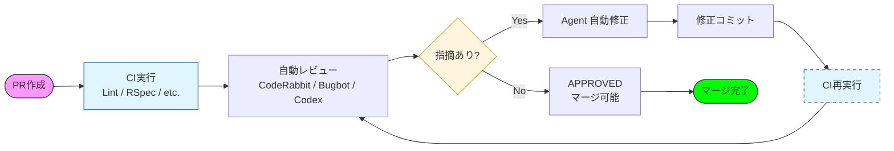
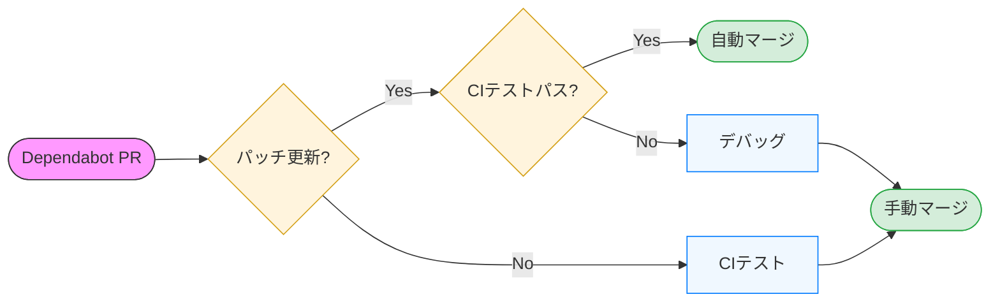

# CI で使うセキュリティ・品質ツールを、役割ごとに並べた一覧

このドキュメントでは、Rails + Vite + Docker + GitHub Actions を前提に、CI/CD で使うセキュリティ・品質ツールを「すでに導入しているもの」と「それと役割が被らない追加候補」に分けて整理しています。各ツールの役割・対象・特徴・導入方法をまとめ、最後に状況に応じた検討候補の表を載せています。

## なぜこうしたツールを導入するか

本番障害やセキュリティインシデントは、マージ後に発覚した時点で手遅れになることが多く、修正コストや影響範囲は一気に拡大します。脆弱性は、ソースコードの欠陥だけでなく、依存ライブラリの CVE[^1] やインフラ設定の見落としなど、複数の経路から入り込みます。
これらを マージ前の CI で自動検知・遮断 することで、影響を最小化し、人は設計や仕様判断といった本来注力すべきレビューに集中できます。本ドキュメントでは、同じ役割のツールを重ねるのではなく、「コード・依存関係・コンテナ・運用」と層ごとに役割を分離して選定しています。目的はツール導入ではなく、最低限の品質と安全性を仕組みで保証することです。

## すでにやったことのあるもの

- **Brakeman** … Rails 向け SAST。Rails アプリのソースコードを静的解析して、SQL インジェクションや XSS などのセキュリティ脆弱性を検出する専用スキャナ。
- **RuboCop** … スタイル・品質。Ruby 向けの静的コードアナライザ兼フォーマッタで、Ruby Style Guide に沿ってコードスタイルや設計上の問題をチェックし、自動整形もできる。
- **CodeQL** … Ruby / JS・TS / Actions。GitHub 製のコード解析エンジンで、Ruby や JavaScript/TypeScript などのコードをクエリ言語で解析し、脆弱性やバグを検出して code scanning アラートとして可視化できる。
- **Dependabot** … bundler + npm + actions。GitHub の依存関係アップデート機能で、bundler や npm、GitHub Actions などのライブラリやアクションの新バージョン・脆弱性を監視し、自動で PR を立てて更新提案・自動マージまで行える。
- **RSpec** … テスト。Ruby 向けの BDD スタイルのテストフレームワークで、モデル・コントローラ・リクエストなどアプリの振る舞いを仕様として記述し、CI で自動実行してリグレッションを防ぐ。**E2Eテスト**は RSpec の枠のなかで **Capybara** を使って書き、ブラウザ制御のドライバには Selenium ではなく **Playwright** を指定して実行を高速化している（RSpec → Capybara → Playwright の階層）。

## これらと役割が被らない、追加してみたツール

1. [**Gemfile 非推奨チェック** … Bundler deprecation ガード](#1-gemfile-非推奨チェックお手製)
2. [**OSV Scanner** … 依存関係](#2-osv-scannergoogle)
3. [**Semgrep** … ソースコード SAST](#3-semgrepreturntocorp)
4. [**OSSF Scorecard** … リポジトリ運用](#4-ossf-scorecardopenssf)
5. [**Trivy** … コンテナイメージの脆弱性](#5-trivyaqua-security)
6. [**Hadolint** … Dockerfile のベストプラクティス](#6-haskell-dockerfile-linter-hadolint)

---

### 1. **Gemfile 非推奨チェック**（お手製）

- **役割**: `bundle install` の出力に Bundler の `[DEPRECATED]` が出ていないかを CI で検証する
- **対象**: Gemfile / Gemfile.lock（Bundler が非推奨と判断する書き方・依存の組み合わせ）
- **特徴**: `bin/check-gemfile-deprecations` で実行。Dependabot は「更新の提案」、このジョブは「現状のコードが非推奨を出さないかのガード」なので**役割は被らない**
- **導入**: CI に `gemfile_deprecations` ジョブを追加し、`bin/check-gemfile-deprecations` を実行

**Dependabot との比較**

| | Gemfile 非推奨ジョブ | Dependabot |
|---|------------------------|------------|
| 役割 | 現状の Gemfile が Bundler の deprecation を出さないかチェック | 依存の更新・セキュリティ更新の PR を出す |
| きっかけ | 毎回の CI（push/PR） | 日次スケジュール |
| 結果 | 非推奨が出たら CI 失敗 | 更新可能なら PR 作成 |

Dependabot の PR をマージしたあと、その状態で `bundle install` すると非推奨が出る場合、非推奨ジョブが失敗して「その更新の仕方には問題がある」と教えてくれる**補完関係**になる。

### 2. **OSV Scanner**（Google）

- **役割**: 依存関係の脆弱性スキャン（OSV データベース使用）
- **対象**: Ruby（Gemfile）、JavaScript/TypeScript（package.json）など
- **特徴**: 無料・OSS。Dependabot とは別のデータソースなので、**Dependabot の補完**になる
- **導入**: ワークフロー 1 本追加するだけ。ビルド不要

### 3. **Semgrep**（Returntocorp）

- **役割**: ルールベースの SAST（バグ・脆弱性・コーディング規約）
- **対象**: Ruby, JavaScript, TypeScript など
- **特徴**: 無料枠あり。**CodeQL / Brakeman と違うルールセット**なので、追加でバグや脆弱性を拾える
- **導入**: 公式の GitHub Action をワークフローに 1 ジョブ追加

「CodeQL や Brakeman と重複するのでは？」という点は、ルールが違うので**併用**で問題ありません（アラートが増えすぎたらルールを絞る運用でよいです）。

### 4. **OSSF Scorecard**（OpenSSF）

- **役割**: リポジトリの**サプライチェーン・運用の健全性**をスコアリング（ブランチ保護、署名、依存関係の更新など）
- **対象**: リポジトリ全体（言語非依存）
- **特徴**: 無料・OSS。**設定や運用の穴**をチェックしたいときに便利
- **導入**: 公式の Scorecard Action を週次などで 1 回実行するワークフローを追加

### 5. **Trivy**（Aqua Security）

- **役割**: コンテナイメージの脆弱性スキャン（OS パッケージ + 言語依存関係）
- **対象**: Dockerfile からビルドしたイメージ
- **特徴**: 無料・OSS。**本番で使うイメージを push 前にスキャン**するのに向いている
- **導入**: イメージをビルドするタイミング（例: Fly デプロイ前や専用ワークフロー）で `trivy image` を実行

既に **CodeQL / Brakeman / Dependabot** で「ソース＋依存」は見ているので、**コンテナ層**を Trivy でカバーする。

### 6. **Haskell Dockerfile Linter (hadolint)**

- **役割**: Dockerfile の**ベストプラクティス・構文チェック**（Best practices for Dockerfiles に基づく）
- **対象**: Dockerfile
- **特徴**: 無料・OSS。Trivy はイメージの脆弱性スキャン、hadolint は **Dockerfile の書き方**（レイヤー効率、セキュリティ推奨など）をチェックするので役割が異なる
- **導入**: hadolint-action で Dockerfile を解析し、SARIF 形式で Code scanning にアップロードするワークフローを追加

---

## オプション

### 他のツールと役割は重なるが、動作が軽く補完的に使えるため、任意で採用しているもの。

- **bundler-audit** … 依存関係。Gemfile.lock を Ruby Advisory DB（ruby-advisory-db）と照合し、既知の CVE があれば CI で失敗させる。OSV Scanner と役割は一部重複するが、Ruby コミュニティがメンテナンスする ruby-advisory-db に基づく検査であり、データソースが異なる。動作が軽いため、OSV とは別の観点で二重チェックしたい場合のオプションとして入れておいてよい。

| 観点          | bundle-audit だけ                  | OSV Scanner だけ                                | 両方使う場合の価値                                         |
| ----------- | -------------------------------- | --------------------------------------------- | ------------------------------------------------- |
| gem だけのスキャン | RubySec 特化型でシンプル                 | OSV DB 由来で Ruby はサポート                 | データベースが異なるため「片方だけ漏れ」を防げる                          |
| 言語・エコシステム   | Ruby 限定                          | Ruby, Node.js, Python, Go など多言語          | Ruby プロジェクトなら、Ruby は両方でカバー                        |
| 依存関係の深さ     | Gemfile.lock だけ                  | Gemfile.lock だけでなく SBOM / コンテナイメージのレイヤまでjit+1 | Ruby は bundle‑audit、他の言語やコンテナは OSV Scanner で分担できる |
| データベース元     | RubySec / ruby‑advisory‑db | OSV DB（多言語 OSS 脆弱性データベース）      | 同じ Ruby gem でも、登録タイミングやアドバイス内容が微妙に違う場合がある         |

---

### 状況に応じて検討

| ツール | 役割 | 入れるとよいケース |
|--------|------|---------------------|
| **Snyk** | 依存関係・コンテナ・IaC | 依存関係＋コンテナを 1 ツールでまとめたい、無料枠で試したい |
| **Bearer** | SAST + 秘密・PII 検出 | 秘密情報や個人データの扱いをコードでチェックしたい |
| **Dependency Review**（GitHub 標準） | PR での依存関係変更の差分チェック | Dependabot の PR をマージする前に「何が変わったか」を見たい |

## サンプル画面

## CIとAI自動レビューの流れ

PR を作成すると次のような流れで CI と AI による自動レビューが動きます。

1. **PR 作成**  
   `main` 向けに PR を出すと、GitHub Actions がトリガーされます。

2. **CI 実行**  
   まず **CI**（`.github/workflows/ci.yml`）が走り、依存関係チェック（Gemfile 非推奨・bundler-audit）、Lint（RuboCop・Brakeman）、テスト（RSpec）が並列で実行されます。あわせて **Hadolint / OSV-Scanner / Semgrep / Trivy / Scorecard** などのセキュリティ系ワークフローも PR または push で動き、コード・依存・Dockerfile・コンテナイメージ・リポジトリ運用までを自動でチェックします。

3. **AI 自動レビュー**  
   CI の結果に加え、CodeRabbit・Bugbot・Codex などの AI レビューツールが PR の差分を解析し、設計・可読性・潜在バグ・セキュリティ観点でのコメントを付けます。人は「この指摘を直すか」「仕様として許容するか」といった判断に集中できます。

4. **指摘への対応**  
   - **指摘あり** … Agent が自動で修正案を出し、修正コミットを PR に載せることができます。その push で CI が再実行され、再度 AI レビューも走ります。指摘がなくなるまでこのループを回します。  
   - **指摘なし** … レビューが APPROVED となり、ブランチ保護で求めている CI 通過と承認が揃えばマージ可能になります。

5. **マージ**  
   マージ後は、`main` への push に応じて Fly デプロイや R2 アセットアップロードなどが動きます（トリガー・パスは [github-actions.md](github-actions.md) のワークフロー一覧参照）。

フローチャートでは、上記の「PR → CI → AI レビュー → 指摘ありなら Agent 修正・CI 再実行 → 指摘なしなら APPROVED → マージ」という一連の流れを整理しています。

> [!NOTE]
> 出典: 『Software Design 2025年12月号』p.130 木下雄一郎 著 「AI時代のコードレビュー」掲載の図を参考に作成。

## Dependabot PR を自動マージする流れ

Dependabot が立てた PR を「パッチ更新かどうか」で分け、パッチ更新は CI 通過後に自動マージ、それ以外は手動マージする構成です。

1. **Dependabot が PR を作成**  
   **Dependabot**（`.github/dependabot.yml`）が日次で **bundler**（Gemfile）・**npm**（package.json）・**github-actions** を監視し、更新可能なら PR を開きます。同時に開く PR は各エコシステムあたり最大 10 本（`open-pull-requests-limit: 10`）です。

2. **パッチ更新かどうかの判定**  
   **Dependabot auto-merge**（`.github/workflows/dependabot-auto-merge.yml`）が、PR 作成時に `dependabot/fetch-metadata` で更新タイプ（semver-patch / minor / major など）を取得します。

3. **パッチ更新の場合**  
   - **CI がパス** … `enable-auto-merge` ジョブが `gh pr merge --auto --merge` で auto-merge を有効化しています。続いて **CI** が走り、CI が成功すると `workflow_run` で **merge-when-ready** ジョブが動き、同じブランチの Dependabot パッチ PR で auto-merge が有効なら **即マージ**します（[github-actions.md](github-actions.md) の「Dependabot auto-merge」参照）。  
   - **CI が失敗** … auto-merge は有効のままですが、マージ条件（CI 成功）を満たさないためマージされません。原因を確認して修正し、CI を通したうえで **手動マージ**するか、Dependabot の再実行を待ちます。

4. **パッチ更新ではない場合（minor / major など）**  
   auto-merge は有効化されません。CI は通常どおり走るので、結果を確認したうえで **手動マージ**します。破壊的変更や仕様変更の可能性があるため、意図的に自動マージの対象外にしています。

フローチャートでは、上記の「Dependabot PR → パッチか？ → パッチなら CI パスで自動マージ／失敗ならデバッグ→手動マージ」「パッチでなければ CI 後に手動マージ」という流れを整理しています。

[^1]:CVE は「Common Vulnerabilities and Exposures」の略で、公開されたセキュリティ脆弱性に一意の ID を付けて管理するための共通番号・リストです。
